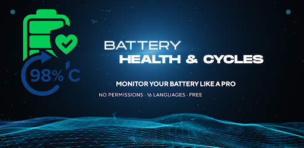
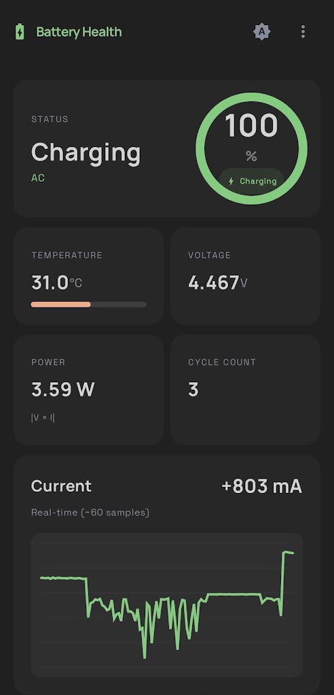
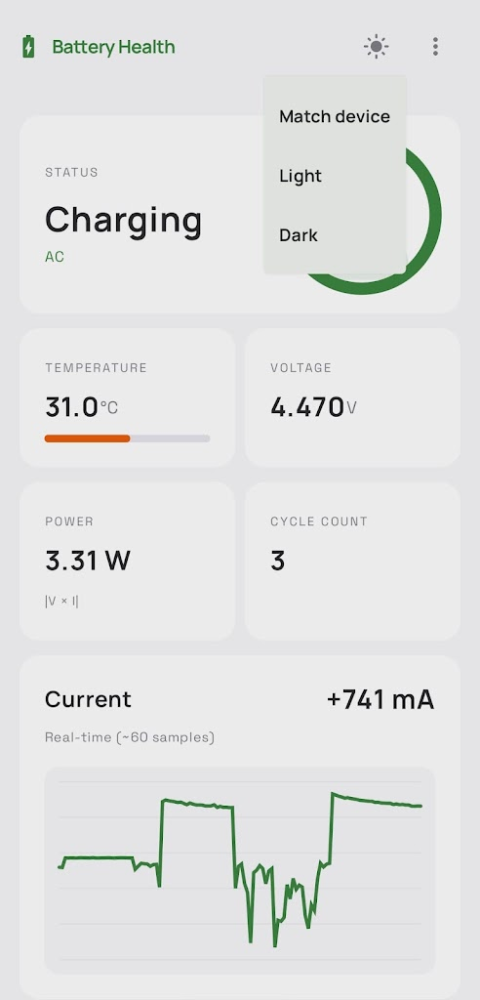
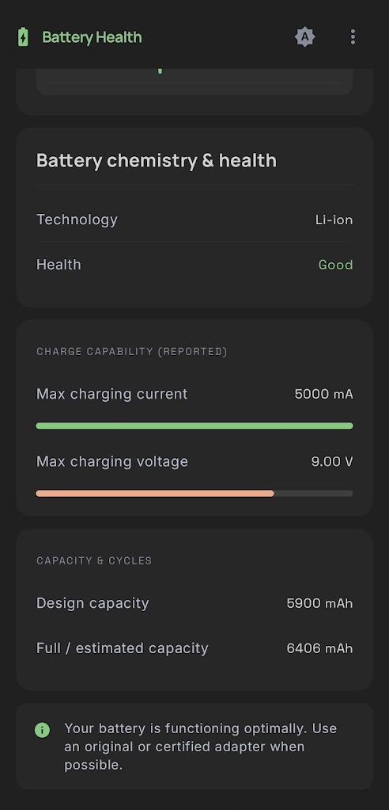
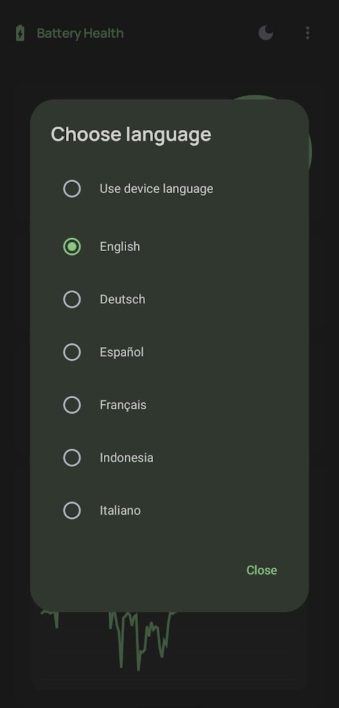

<p align="center">
  
</p>

<h1 align="center">ABattery - Battery Health & Cycles</h1>

<p align="center">
  A privacy-friendly, open-source Android app for understanding battery health, charging behavior, capacity, and cycle count.
</p>

<p align="center">
  <a href="https://github.com/abanana84/abattery/actions/workflows/android.yml"></a>
  <a href="https://play.google.com/store/apps/details?id=com.abanana.abattery"></a>
  <a href="https://github.com/abanana84/abattery/releases"></a>
  <a href="LICENSE"></a>
  
</p>

<p align="center">
  <strong><a href="https://play.google.com/store/apps/details?id=com.abanana.abattery">Get it on Google Play</a></strong>
  &nbsp;&middot;&nbsp;
  <a href="https://github.com/abanana84/abattery/issues/new?template=bug.yml">Report a bug</a>
  &nbsp;&middot;&nbsp;
  <a href="https://github.com/abanana84/abattery/issues/new?template=feature.yml">Request a feature</a>
</p>

## Why ABattery?

Android exposes useful battery data across several APIs and device-specific system files. ABattery brings the available signals into one readable Material 3 dashboard, while clearly marking values that are estimated or unavailable.

- Real-time battery level, charge status, temperature, voltage, current, and power
- Reported or best-effort cycle count with estimated values clearly marked
- Design capacity and full-charge capacity when the device exposes them
- Live current chart for charging and discharging behavior
- Light, dark, and system themes
- 16 languages
- No ads, analytics, account, or Internet permission
- No runtime permission prompts

## Screenshots

<p align="center">
  
  
  
  
</p>

## Device compatibility

Battery reporting varies significantly between Android versions and manufacturers. ABattery reads data from Android's battery APIs first, then uses available system information and local estimation as fallbacks.

Some devices hide capacity, cycle count, or charging limits. In those cases ABattery shows `N/A` instead of inventing a value. The app is a diagnostic tool, not a laboratory measurement or a replacement for manufacturer service tools.

If a field behaves differently on your device, please open a [compatibility report](https://github.com/abanana84/abattery/issues/new?template=bug.yml) with the phone model and Android version.

## Build from source

### Requirements

- Android Studio with Android SDK 35
- JDK 17
- Android 8.0 (API 26) or newer for the target device

### Commands

```bash
git clone https://github.com/abanana84/abattery.git
cd abattery
./gradlew assembleDebug
```

The debug APK is generated at `app/build/outputs/apk/debug/app-debug.apk`.

Run the same checks used by CI:

```bash
./gradlew testDebugUnitTest lintDebug assembleDebug
```

## Tech stack

- Kotlin
- Jetpack Compose and Material 3
- Hilt dependency injection
- Coroutines and StateFlow
- Android BatteryManager and system battery signals

## Privacy

ABattery processes battery information on your device. It does not include ads or analytics and does not request Internet access. See the full [privacy policy](PRIVACY.md).

## Contributing

Bug reports, device compatibility findings, translations, documentation, and code contributions are welcome. Read [CONTRIBUTING.md](CONTRIBUTING.md) before opening a pull request.

If this project is useful to you, consider starring the repository. It helps other Android users and contributors discover the app.

## License

Licensed under the [Apache License 2.0](LICENSE).
